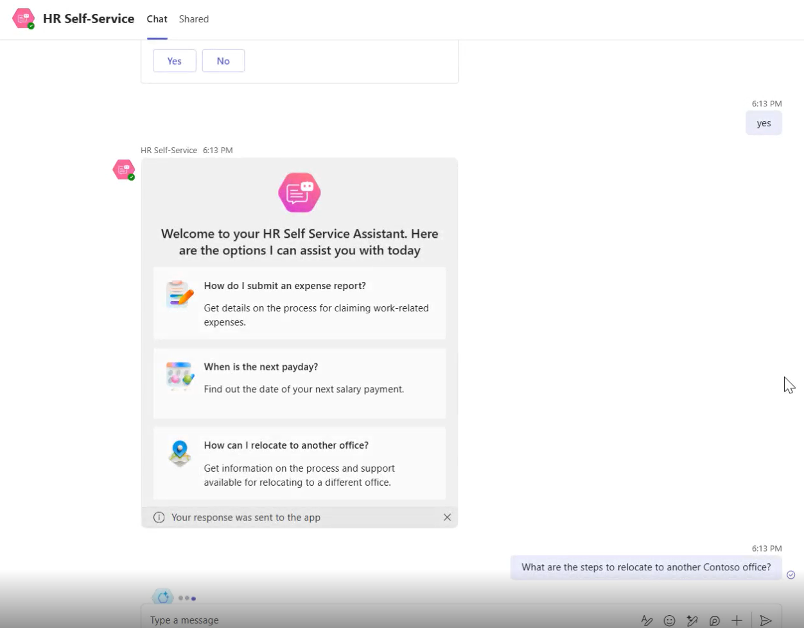
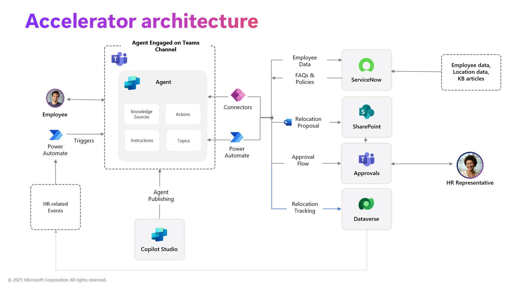

# Agent for HR Service

MENU: [**USER STORY**](#user-story) \| [**QUICK DEPLOY**](#quick-deploy) \| [**SUPPORTING DOCUMENTS**](#supporting-documents)

  

# User Story

## Solution Overview

The Agent for HR Service is designed to assist employees with various HR-related tasks. It provides instant answers, seamless record updates, and automated support, improving efficiency, compliance, and transparency by streamlining HR service workflows. 

This accelerator leverages Copilot Studio, Power Platform, and Microsoft Teams. It also interfaces with Dataverse and integrates the 3rd party business workflow management program, ServiceNow. 

The Agent enables employees to propose a relocation, compare benefits and compensation in different cities, and track the approval process. Upon completion of the relocation process, the company's records are updated and an automation is triggered wherein the Agent for HR Service will reach out for the employee's feedback, all using natural language inside of Microsoft Teams. 

**Note:** This accelerator is not intended to be a production ready solution. The components can be extended through customization and configuration as desired to create a production ready solution. All components packaged have been done through an unmanaged solution, which allows users to be able to customize and extend the components post-deployment. 

## Key features

This accelerator focuses on harnessing the following key capabilities:

* [Generative AI in Copilot Studio](https://learn.microsoft.com/en-us/microsoft-copilot-studio/advanced-generative-actions)
* [Adaptive Cards in Copilot Studio](https://learn.microsoft.com/en-us/microsoft-copilot-studio/guidance/adaptive-cards-overview)
* [Publishing Copilot agent in Microsoft Teams](https://learn.microsoft.com/en-us/microsoft-copilot-studio/publication-add-bot-to-microsoft-teams)
* [Capturing digital approvals using Approvals in Microsoft Teams](https://learn.microsoft.com/en-us/power-automate/teams/native-approvals-in-teams)
* [Update tables in Dataverse](https://learn.microsoft.com/en-us/training/modules/get-started-with-powerapps-common-data-service/)
* [Using ServiceNow for cloud data integration](https://learn.microsoft.com/en-us/connectors/service-now/)

Additional details on how these capabilities are leveraged in this accelerator can be found here:

* [Autonomous Agent Capabilities](./Deployment/Differentiators/DIFFERENTIATORS.md#autonomous)
* [Proactive Engagement and Response Routing](./Deployment/Differentiators/DIFFERENTIATORS.md#proactive_engagement)
* [Integration to HR System (ServiceNow)](./Deployment/Differentiators/DIFFERENTIATORS.md#hr_integration)
* [Approval Tracking](./Deployment/Differentiators/DIFFERENTIATORS.md#approvals)
* [Document Manipulation](./Deployment/Differentiators/DIFFERENTIATORS.md#document_manipulation)
* [Dynamically-Generated Adaptive Cards in Topics](./Deployment/Differentiators/DIFFERENTIATORS.md#adaptive_cards)
* [Use of Custom Entities and Slot Filling](./Deployment/Differentiators/DIFFERENTIATORS.md#slot_filling)

Below is a sample landing page of the solution accelerator after it is deployed, set up, and ready to be used:

## Scenario

Pier, an employee of Contoso, is looking to relocate to a new city. Pier initiates contact with the HR agent to understand the relocation process and its potential impacts. The agent provides information on relocation compensation and helps Pier assess the financial implications. The agent offers to initialize a relocation request. Pier submits a relocation request through the agent. The HR team reviews and approves the request. Pier receives a notification in the Teams channel about the approval. The agent generates necessary documents for the relocation process. After the relocation process is complete, Pier receives an autonomous satisfaction survey to provide feedback on the interaction with the HR agent and the overall process

### Highlights
- Knowledge Retrieval: The agent retrieves relevant information and documents from various sources, including SharePoint and ServiceNow
- Action Execution: The agent performs actions such as initiating requests, generating documents, and sending notifications
- System Integration: The agent integrates with existing HR systems like Workday, SAP SuccessFactors, and ServiceNow to provide a seamless experience. The agent can be customized to handle various HR scenarios, such as onboarding, offboarding, talent development, and performance management 

Overall, the HR Agent helps Pier by providing instant answers, automating routine tasks, and ensuring seamless integration with existing HR systems, thereby enhancing efficiency and the overall employee experience.

  

# Quick Deploy

Please click this [**Link to Deployment Guide**](Deployment/README.md) for instructions on how to deploy and set up the solution accelerator.

[**Usage Guidance**](Deployment/Data/USAGE_GUIDANCE.md) has been provided to assist you in executing the steps required to see the included capabilities of this accelerator in action.

## Solution Accelerator Architecture

  

# Supporting Documents

## How to customize

This solution is designed to be easily customizable. All configuration and customizations to this solution will be done in Power Platform, Copilot Studio, and with content and data stored in 3rd party platform ServiceNow.

### Additional opportunities for extension

There are a variety of opportunities to extend the functionality of this accelerator. Some of these include:

 * Augmenting the sequence of steps involved in the relocation process, to match organizational practices
 * Catering for additional HR-related processes beyond relocations
 * Adapting or augmenting approval logic to match organizational practices
 * Integrating with additional systems of record for HR-related data and content
 * Integrating eSignature capabilities for document acceptance
    * An example of eSignature integration can be seen in the [Agent for Contract Processing Solution Accelerator](https://github.com/microsoft/Agent-for-Contract-Processing-Solution-Accelerator)

## Additional resources

1. [Microsoft Power Platform](https://learn.microsoft.com/en-us/power-platform/)
2. [Microsoft Copilot Studio](https://learn.microsoft.com/en-us/microsoft-copilot-studio/)

# Disclaimers

This release only supports English language input and output. Users should not attempt to use the system with any other language or format. The system output may not be compatible with any translation tools or services, and may lose its meaning or coherence if translated.

This release does not reflect the opinions, views, or values of Microsoft Corporation or any of its affiliates, subsidiaries, or partners. The system output is solely based on the system's own logic and algorithms, and does not represent any endorsement, recommendation, or advice from Microsoft or any other entity. Microsoft disclaims any liability or responsibility for any damages, losses, or harms arising from the use of this release or its output by any user or third party.

This release is intended as a proof of concept only, and is not a finished or polished product. It is not intended for commercial use or distribution, and is subject to change or discontinuation without notice. Any planned deployment of this release or its output should include comprehensive testing and evaluation to ensure it is fit for purpose and meets the user's requirements and expectations. Microsoft does not guarantee the quality, performance, reliability, or availability of this release or its output, and does not provide any warranty or support for it.

This Software requires the use of third-party components which are governed by separate proprietary or open-source licenses as identified below, and you must comply with the terms of each applicable license in order to use the Software. You acknowledge and agree that this license does not grant you a license or other right to use any such third-party proprietary or open-source components.

To the extent that the Software includes components or code used in or derived from Microsoft products or services, including without limitation Microsoft Azure Services (collectively, “Microsoft Products and Services”), you must also comply with the Product Terms applicable to such Microsoft Products and Services. You acknowledge and agree that the license governing the Software does not grant you a license or other right to use Microsoft Products and Services. Nothing in the license or this ReadMe file will serve to supersede, amend, terminate or modify any terms in the Product Terms for any Microsoft Products and Services.

You must also comply with all domestic and international export laws and regulations that apply to the Software, which include restrictions on destinations, end users, and end use. For further information on export restrictions, visit [https://aka.ms/exporting](https://aka.ms/exporting).

You acknowledge that the Software and Microsoft Products and Services (1) are not designed, intended or made available as a medical device(s), and (2) are not designed or intended to be a substitute for professional medical advice, diagnosis, treatment, or judgment and should not be used to replace or as a substitute for professional medical advice, diagnosis, treatment, or judgment. Customer is solely responsible for displaying and/or obtaining appropriate consents, warnings, disclaimers, and acknowledgements to end users of Customer’s implementation of the Online Services.

You acknowledge the Software is not subject to SOC 1 and SOC 2 compliance audits. No Microsoft technology, nor any of its component technologies, including the Software, is intended or made available as a substitute for the professional advice, opinion, or judgement of a certified financial services professional. Do not use the Software to replace, substitute, or provide professional financial advice or judgment.

BY ACCESSING OR USING THE SOFTWARE, YOU ACKNOWLEDGE THAT THE SOFTWARE IS NOT DESIGNED OR INTENDED TO SUPPORT ANY USE IN WHICH A SERVICE INTERRUPTION, DEFECT, ERROR, OR OTHER FAILURE OF THE SOFTWARE COULD RESULT IN THE DEATH OR SERIOUS BODILY INJURY OF ANY PERSON OR IN PHYSICAL OR ENVIRONMENTAL DAMAGE (COLLECTIVELY, “HIGH-RISK USE”), AND THAT YOU WILL ENSURE THAT, IN THE EVENT OF ANY INTERRUPTION, DEFECT, ERROR, OR OTHER FAILURE OF THE SOFTWARE, THE SAFETY OF PEOPLE, PROPERTY, AND THE ENVIRONMENT ARE NOT REDUCED BELOW A LEVEL THAT IS REASONABLY, APPROPRIATE, AND LEGAL, WHETHER IN GENERAL OR IN A SPECIFIC INDUSTRY. BY ACCESSING THE SOFTWARE, YOU FURTHER ACKNOWLEDGE THAT YOUR HIGH-RISK USE OF THE SOFTWARE IS AT YOUR OWN RISK.
